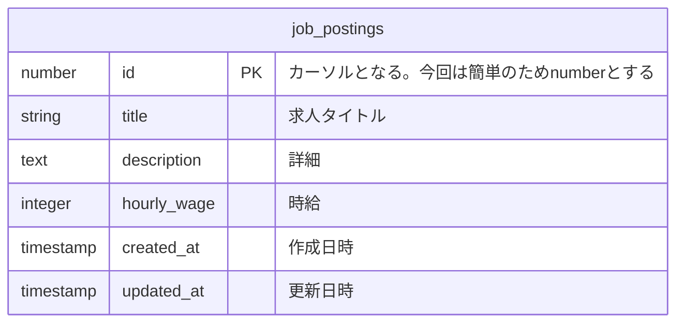

# Paginationとは？
ページネーションとは、一度のリクエストで、すべてのデータを取得するのではなく、少量のデータチャンクに分割し、リクエストを行う技術だ。求人一覧などを閲覧する際に、リソースの数やリソースのサイズが1つのAPIレスポンスでは大きすぎる場合に、有効な手段である。ページネーションは、Googleの検索のページ番号や、Xのタイムラインなどの無限スクロールなどを実現している。

ページネーションは、本のページをめくるように、データチャンクをページという単位で、処理する（これをページングという）。クライアントは、有限のデータチャンクを要求し、APIは対応するデータチャンクとクライアントが取得したいチャンクの開始地点となるポインタを返却する。これを繰り返すことで、まるで、ページをめくるかのように、データを取得できるわけだ。

ページネーションには、いくつか手法がある。それぞれの違いは、クライアントが取得したいチャンクの開始地点となるポインタの実装である。ここでは、有名な2つの実装を見ていく:
- カーソルベースページネーション
- オフセットベースページネーション

## Cursor Based Pagination
時系列など、ソート可能なIDを持つデータに対し、そのIDを目印にし、検索を行う方法である。
カーソルベースページネーションで重要となるパラメータは、以下となる：
-  `cursor`：ソート可能な何かしらのID。例えば、ユニークかつ、時間でソートのできるUUID v7やULIDなどがある。ここで、createdAtなどの日時は、一意に定まるとは限らないため、カーソルに市内方が良い。
- `maxPageSize`：クライアントが取得したい件数の上限である。
- `nextCursor` ：APIがクライアントにレスポンスを返す際に渡す次の目印。
ここで、よくレスポンスの中に、全件数を取得したい場合がある。これは、184件中10～20件目のようなUIでの利用するために要求される。もし、この全件数が極めて大きい値になるのであれば、DBに負荷を与えるため、全件数をレスポンスに含めるのは控えた方が良い。
もし、必要な場合は、`totalCounts`変数とかでレスポンスに含めてあげる。

### メリット
- 無限スクロールなど、データの件数が多い場合に、パフォーマンスが低下しにくい。
	- 取得できるページ数が一定なため、データを取得する際に、パフォーマンスを低下させにくくできる。ただし、logの計算量で取得するためには、インデックスを効かせる必要がある。
- 新規にデータが挿入された場合であっても、検索結果を変えることなく、対応できる
	- 例えば、Xのような更新データの多いタイムライン表示では、次に説明するオフセットベースだとページ切り替えのときに検索結果が変わってしまう。これは、オフセットベースが次にどこから、取得するかポインタを持たないために起こる不整合である。 

### デメリット
- このパターンでは、ページ番号が存在しないため、特定のページへのアクセスはできなくなる。「前へ」「次へ」のリンクのみ。そのため、ページ番号を指定して、データチャンクを取得したい場合は、オフセットベースも選択肢になる。
- SQLのWHERE句の条件にカーソルを利用しているため、カーソルの指し示すデータが削除されると、ページングができなくなる。


### Implementation
例えば、求人の一覧を10件ずつ取得する場合を考える。テーブルは以下のような例を利用する。
テーブル

#### API Design
- request
```bash
GET /api/v1/job-postings?cursor=550e8400-e29b-41d4-a716-446655440000&limit=10
```
- response
```json
{
  items:[], // 求人一覧の配列
  "meta": {
    "nextCursor": "440e8400-e29b-41d4-a716-446655449999",
    "hasMore": true,
    "totalCounts": 184
  }
}
```

#### Query Sample
クエリは以下のようになる。ここで、cursor=20ならば、id=21から10件を 降順（大きい順、新しい順）で取得する。
```sql
 SELECT *
 FROM job_postings
 WHERE id < cursor
 LIMIT 10
 ORDER BY id DESC;
```

## Offset Based Pagination
特定のオフセット（基準となる位置からのずれ）から始まるデータを要求し、結果のサイズを特定の数に制限することで、データチャンクを取得する方法である。
offsetとlimit、または、page番号とlimitのペアをパラメータとして、検索を実行する。ここで、各パラメータはそれぞれ、以下のような意味を持つ：
-  `offset`：何件目から取得するかを示すパラメータ。
- `page`：ページ番号。バックエンドなどで、page × limitで、オフセットを算出する。
- `limit` ：APIがクライアントに要求する取得件数

### メリット
- 実装が簡潔である。基本的に、パラメータさえ渡せば、 SQLのOFFSETを使えば良い。
### デメリット
- サイズの大きい結果に対して、大きなオフセットを指定すると、パフォーマンスに悪影響を与える。これは、物理的に先頭から順番に数え直さなければならないからである。$\mathcal{O}(N_{\mathbf{offset}})$、$N_{\mathbf{offset}}$はオフセットのサイズ。
- 新しい結果が追加されると、以前の結果で既に見られた結果が返される可能性がある。


### Implementation
カーソルベースと同様に、求人の一覧を10件ずつ取得する場合を考える。
#### API Design
- request
```bash
GET /api/v1/job-postings?offset=30&limit=10
```
または、
```bash
GET /api/v1/job-postings?page=3&limit=10?
```
- response
```json
response: {
  items:[], // 求人一覧の配列
  meta: {
    total: "合計件数",
    totalPages: "合計ページ数",
    limit: "1ページあたり件数",
  }  
}
```
#### Query Sample
クエリは以下のようになる。ここで、cursor=20ならば、id=21から10件を取得する。
```sql
 SELECT *
 FROM job_postings
 ORDER BY id DESC
 LIMIT 10
 OFFSET 10;
```

# 世の中、どんな実装になっているか？
TODO: Googleの検索の実装について書きたい

# Prismaによるによる実装例
prismaでは、Cursorベースのページネーションを行うAPIのインタフェースが用意されている。
[Pagination (Reference) | Prisma Documentation](https://www.prisma.io/docs/orm/prisma-client/queries/pagination)
## Offset Based
```ts
const jobPostings = await prisma.jobPosting.findMany({
  take: limit,           // LIMIT, ex 10
  skip: offset,           // OFFSET, ex 30
  orderBy: {
    id: 'desc',       // ORDER BY id DESC
  },
});
```

## Cursor Based

```ts
const results = this.prisma.jobPosting.findMany({
	take: maxPageSize + 1, // 次のページがあるかを確認するために+1
	skip: cursorId ? 1 : 0, // カーソルの次の要素から取得
	cursor: cursorId ? { id: cursorId } : undefined,
	orderBy: {
	    id: 'desc',       // ORDER BY id DESC
	},
  });
```

ここで、タイムスタンプをCursorにしたい場合には、Cursor情報に`create_at`を渡す必要がない。prismaでは、以下のように、
```sql
SELECT
  "public"."office_evaluations"."id",
  "public"."office_evaluations"."office_id",
  "public"."office_evaluations"."office_name",
  "public"."office_evaluations"."five_point_score",
  "public"."office_evaluations"."worker_evaluation_comment",
  "public"."office_evaluations"."evaluation_status",
  "public"."office_evaluations"."created_at"
FROM
  "public"."office_evaluations"
WHERE
  (
    "public"."office_evaluations"."office_id" = $1
    AND (
      -- 条件A: 作成日時がカーソルと同じで、かつIDがカーソル以下（ID順で後ろ）の場合
      (
        "public"."office_evaluations"."created_at" = (
          SELECT "public"."office_evaluations"."created_at"
          FROM "public"."office_evaluations"
          WHERE ("public"."office_evaluations"."id") = ($2)
        )
        AND "public"."office_evaluations"."id" <= (
          SELECT "public"."office_evaluations"."id"
          FROM "public"."office_evaluations"
          WHERE ("public"."office_evaluations"."id") = ($3)
        )
      )
      -- 条件B: または、作成日時がカーソルより古い場合
      OR (
        "public"."office_evaluations"."created_at" < (
          SELECT "public"."office_evaluations"."created_at"
          FROM "public"."office_evaluations"
          WHERE ("public"."office_evaluations"."id") = ($4)
        )
      )
    )
  )
ORDER BY
  "public"."office_evaluations"."created_at" DESC,
  "public"."office_evaluations"."id" DESC
LIMIT $5
OFFSET $6;
```


# 参考文献
- [Offset / Cursor Paginationについて - Speaker Deck](https://speakerdeck.com/nearme_tech/offset-cursor-pagination)
- [ページネーション - kawasima](https://scrapbox.io/kawasima/%E3%83%9A%E3%83%BC%E3%82%B8%E3%83%8D%E3%83%BC%E3%82%B7%E3%83%A7%E3%83%B3)
- [APIデザイン・パターン (Compass Booksシリーズ) | JJ Geewax, 松田晃一 |本 | 通販 | Amazon](https://www.amazon.co.jp/API%E3%83%87%E3%82%B6%E3%82%A4%E3%83%B3%E3%83%BB%E3%83%91%E3%82%BF%E3%83%BC%E3%83%B3-Compass-Books%E3%82%B7%E3%83%AA%E3%83%BC%E3%82%BA-JJ-Geewax/dp/4839979391/ref=asc_df_4839979391?mcid=23e421bb08a53a668c028d67be1ed2f6&th=1&psc=1&tag=jpgo-22&linkCode=df0&hvadid=707442440817&hvpos=&hvnetw=g&hvrand=8600920107281175438&hvpone=&hvptwo=&hvqmt=&hvdev=c&hvdvcmdl=&hvlocint=&hvlocphy=1009309&hvtargid=pla-1712381020968&psc=1&hvocijid=8600920107281175438-4839979391-&hvexpln=0)
- [Pagination issue with cursor and sorting by createdAt · Issue #16991 · prisma/prisma](https://github.com/prisma/prisma/issues/16991)
- [Improve cursor pagination to tolerate hard deletes and avoid looking up the row at the cursor · Issue #19159 · prisma/prisma](https://github.com/prisma/prisma/issues/19159)